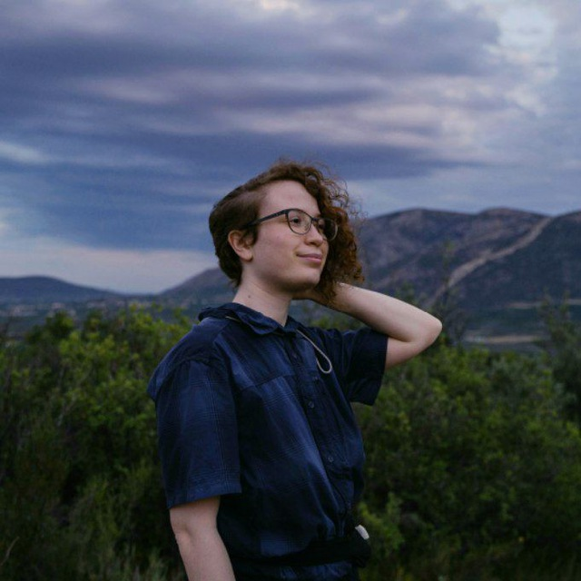

<h1 align="center">Chi sono io?</h1>
<table>
  <tbody>
    <tr>
      <td><b>Kai</b></td>
      <td width="50%" rowspan="3">
        
      </td>
    </tr>
    <tr>
      <td>
        Kai, paleontologo e biologo evoluzionista, persona dalle mille passioni. Nel tempo libero creo videogiochi, suono la batteria, e faccio fumetti e illustrazioni preistoriche. 
      </td>
    </tr>
    <tr>
      <td>
        <ul>
          <li>Scrivimi: kai.paleothero@gmail.com</li>
          <li><a href="https://www.researchgate.net/profile/Alessia-Buccella-2">Researchgate</a></li>
          <li><a href="https://github.com/dromaeo">GitHub</a></li>
          <li><a href="https://orcid.org/0009-0000-4547-7177">OrcID</a></li>
        </ul>
      </td>
    </tr>
        <tr><td><b>Pubblicazioni</b></td>
        </tr>
    <tr>
      <td width="50%" colspan="2">
        <ul>
          <li> A. Buccella, E. Puertolas-Pascual, F. Fanti, M. Moreno-Azanza, ”Whose child is this? Juvenile features on an isolated crocodylomorph dentary from the Early Cretaceous of Galve, Spain” in Georgalis G. L., Sulej T., Belvedere M. Sanchez- Villagra M. (eds.). Book of Abstracts ofthe XXII Annual Meeting ofthe European Association of Vertebrate Palaeontologists, 30 June–5 July 2025, Krakow, Poland. Palaeovertebrata, p. 133–134.
          </li><li>
 A. Buccella, E. Puertolas-Pascual, M. Moreno-Azanza, F. Fanti ”An unexpected Crocodylomorph from the Early Cretaceous of Galve, Spain? New perspectives on an isolated dentary from Cuesta Corrales 2” in E. Vlachos, V. D. Crespo, M. Rıos Ibanez, A. Gamonal, E. Jimenez Hidalgo, R. Guerrero-Arenas, F. A. M. Arnal, A. Allende Mosquera, and J. Gonzalez-Dionis (eds)  Book of Abstracts of the 5th Palaeontological Virtual Congress, March 2025, p.239.</li>
          <li> A. Buccella, E. Puertolas-Pascual, M. Moreno-Azanza, ”An unusual archosaur dentary from the Lower Cretaceous of Teruel, Spain” in G. Bianucci, M. Merella A. Collareta Book of Abstracts of Paleodays 2024 - XXIV edition of the ”Giornate di Paleontologia”, 5-7 June 2024, Italy, p.40.</li>
        </ul>
      </td>
      <td></td>
    </tr>
   <tr><td colspan="2"><b>Educazione</b></td></tr>
    <tr>
      <td width="50%" colspan="2">
        <ul>
          <li>BIODIVERSITA ED EVOLUZIONE - Laurea magistrale 2022 - 2025
Universita di Bologna, Italia 
            
· 110/110 cum laude: Tesi: ”Anatomical description and phylogenetic affinities of an enigmatic Crocodylomorph dentary from the Lower Cretaceous of Teruel, Spain” (Supervisor: Federico Fanti, Co-supervisor: Miguel Moreno-Azanza).

· Erasmus+ traineeship in Zaragoza (Spagna) in digital Vertebrate Paleontology.
</li><li>SCIENZE AMBIENTALI E NATURALI - Laurea triennale 2019 - 2022
Universita di Genova, Italia
  
  · 110/110 cum laude: Tesi: ”Analisi filogenetica dei recettori GABA nei deuterostomi” (Supervisor: Simona Candiani, Co-supervisor: Matteo Bozzo).
</li>
        </ul>
      </td>
    </tr>
    <tr><td><b>Skillset</b></td></tr>
    <tr>
      <td width="50%">
        <ul>
          <li><a href="./Pages/education.md">Skillset</a></li>
          <li><a href="./Pages/experience.md">Experience</a></li>
          <li><a href="./Pages/projects.md">Projects</a></li>
          <li><a href="./Pages/qualifications.md">Skills & Qualifications</a></li>
          <li><a href="./Pages/extracurriculars.md">Honors & Extracurriculars</a></li>
          <li>. . .</li>
        </ul>
      </td>
    </tr>
  </tbody>
</table>
