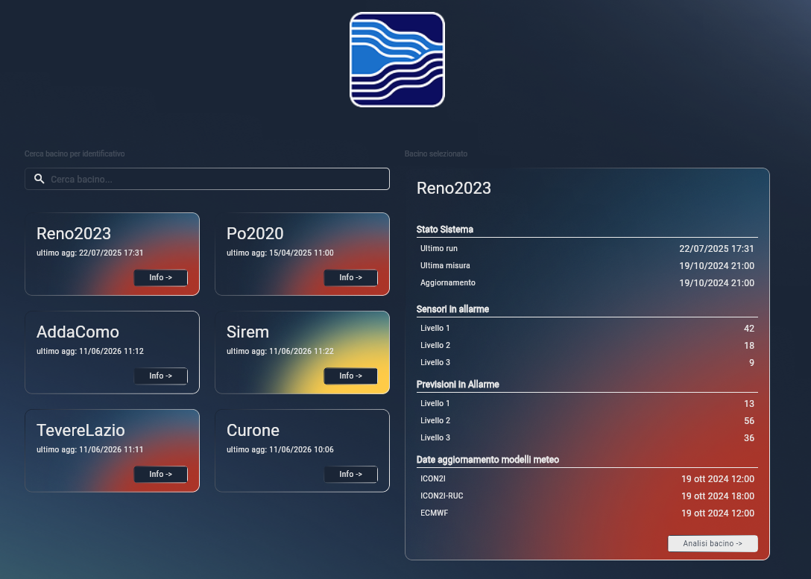
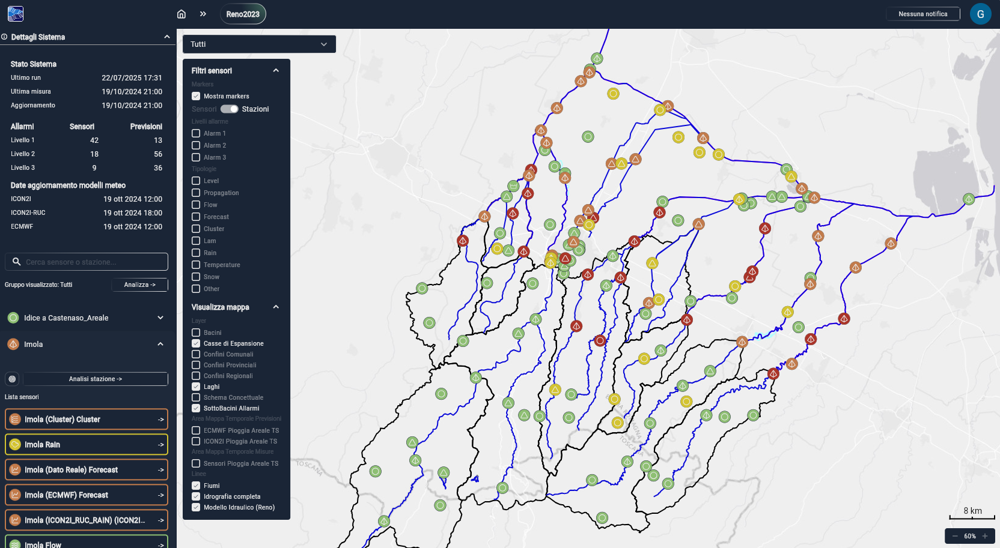
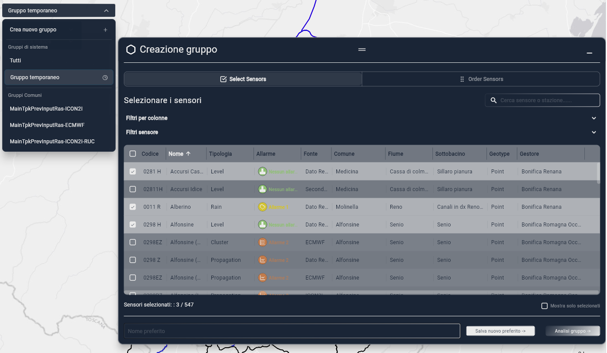
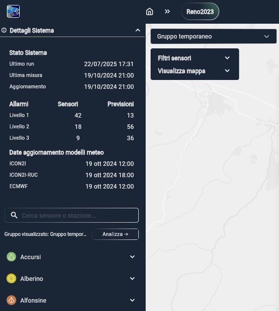
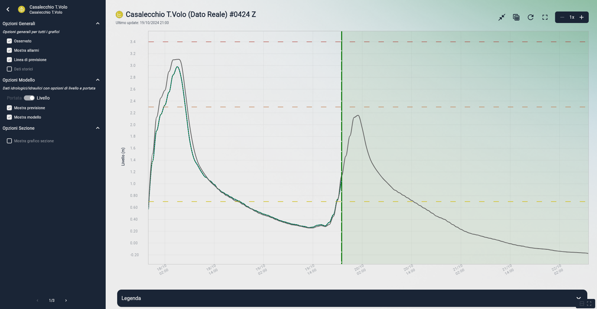
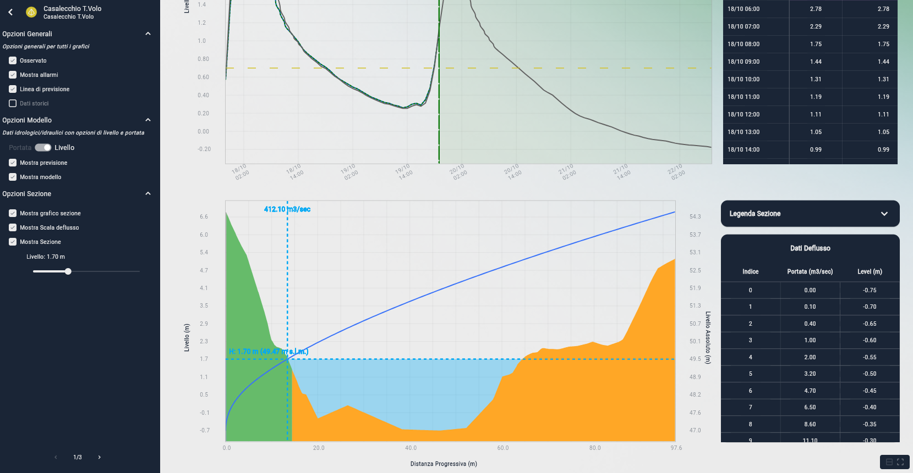

# EFFORTS WEB - Manuale utente 
Il software EFFORTS (Real-Time Flood Forecasting and monitoring System) fornisce un sistema per la previsione di piena in tempo reale. La versione web permette un'accesso immediato ai dati rilevati sul territorio.

## Contenuti
[1. Accesso](#1-accesso)
[2. Selezione bacini](#2-selezione-dei-bacini)
[3. Schermata GIS](#3-schermata-gis)
[4. Schermata Stazione](#4-schermata-stazione)
[5. Schermata Sensore](#5-schermata-sensore)
[6. Opzioni sensore](#6-opzioni-per-ogni-tipo-di-sensore)
[7. Impostazioni](#7-impostazioni)

# 1. Accesso
Inserire i propri dati utente (email e password). In caso di problemi, scrivere a segreteria@progea.net

# 2. Selezione dei bacini
La schermata di apertura dell'applicazione premette di selezionare il bacino da analizzare. Premendoci sopra si aprirà la schermata GIS [(paragrafo 3)](#3-schermata-gis). 
Al di sotto del nome del bacino è visibile l'orario dell'ultimo aggiornamento. 

Premendo sul pulsante "Info" appare una schermata con i dettagli sullo stato del sistema e il livello di allarme massimo attivo. E' possibile passare alla schermata GIS anche premendo "Analisi bacino".

# 3. Schermata GIS
Una volta selezionato un bacino, si aprirà la visualizzazione su mappa GIS che offre una mappa interattiva del bacino idrografico selezionato. 

Lo spostamento sulla mappa avviene con un'azione di trascinamento con il click del mouse. 
Il pulsante destro non è abilitato. 
La rotella del mouse permette di ingrandire o diminuire lo zoom sulla mappa. 
Su dispositivi touch, è abilitato lo spostamento tramite trascinamento e l'ingrandimento tramite pinch.

Premere una delle icone di stazione / sensore la seleziona nella lista visualizzata nella barra laterale sinistra (rimando al [paragrafo 3.5](#35-barra-laterale)) da cui è possibile accedere ai dettagli. 

Nella schermata GIS sono visibili:
-  Stazioni
-  Sensori di diversa tipologia
-  Sensori con un livello di allarme che supera la soglia 1, 2 o 3. Questi sono visualizzati con un'icona rispettivamente gialla, arancione, rossa. 
-  Fiumi, laghi ed idrografia completa
-  Confini regionali, provinciali, comunali

Ciascuno di questi può essere filtrato tramite il menù a tendina sul lato sinistro della mappa. Premendo su "Filtri sensori" o "Visualizza mappa" si apre il menù contenente la lista di checkbox che indicano gli elementi e layer visualizzati in mappa (la lista completa è presentata nel [paragrafo 3.3](#3.3-filtri)). Premendo su di questi, la loro visualizzazione verrà attivata/disattivata. 

## 3.2 Gruppi
Il menù presente in alto, nella parte sinistra della mappa, è il menù dei Gruppi di sensori preferiti. Questo permette di visualizzare solo determinati sensori. 

I gruppi sono di due tipi:
- Gruppi comuni: gruppi di sensori configurati dall'amministratore e visibili a tutti gli utenti del sistema.
- Preferiti: gruppi creati dal singolo utente. 

Per creare un nuovo gruppo Preferito, occorre premere il primo pulsante nella finestra, "Crea nuovo gruppo". 
Si aprirà la schermata di creazione gruppo. Si possono scegliere i sensori tra quelli presenti nel bacino. Sono disponibili filtri per locazione geografica, o per tipo di sensore. 

L'utente ha la possibilità di definire l'ordine dei sensori selezionati, premendo "Order sensors" in alto a destra e trascinando il nome dei sensori nell'ordine preferito. 

Nella barra in basso si inserisce il nome del gruppo. Il pulsante "Salva nuovo preferito" salva il gruppo creato in "Preferiti".

 
Creare un nuovo gruppo genera anche un Gruppo temporaneo di sensori, che può non essere salvato ma essere comunque analizzato, premendo il pulsante in basso a destra "Analisi gruppo". 
Una volta nella schermata di analisi (per la quale si rimanda al [paragrafo 4](#4-schermata-stazione)), è ancora possibile salvare il gruppo come preferito con il pulsante in basso a sinistra "Salva nuovo preferito".

## 3.3 Filtri
### 3.3.1 Filtri sensori
E' possibile scegliere se visualizzare le stazioni o i sensori, con un toggle. Si può disattivare la visualizzazione dei loro simboli su mappa GIS premendo "Mostra markers". 

I filtri disponibili includono:
- livelli di allarme:
	- sensori al di sopra della prima soglia di allarme 
	- sensori al di sopra della seconda soglia di allarme 
	- sensori al di sopra della terza soglia di allarme 
- tipologie di sensore:
	- level
	- propagation
	- flow
	- forecast
	- cluster
	- Lam
	- rain
	- temperature
	- snow
	- other
	
E' possibile eliminare rapidamente i filtri selezionati premendo "pulisci filtri"
	 
### 3.3.2 Visualizza mappa
Si possono scegliere i layer visibili sulla mappa:
- bacini
- casse di espansione
- confini regionali, provinciali, comunali
- laghi
- schema concettuale
- sottobacini allarmi
- Pioggia areale:
	- Mappa areale previsioni pioggia
	- Mappa areale misurazione pioggia
- fiumi
- idrografia completa
- modello idraulico

## 3.4 Menù ribbon bar
La barra in cima all'applicazione contiene alcuni pulsanti utili:
### Pulsante home
Il pulsante home in alto a sinistra riporta alla schermata di selezione dei bacini.
### Nome del bacino
Premere sopra al nome del bacino riporterà alla schermata di visualizzazione mappa GIS.
#### Notifiche
In alto a destra è presente il pannello notifiche. Le notifiche sono ricevute ogni volta che il sistema viene aggiornato per un determinato bacino. 
Premendo sul pannello, è possibile:
- visualizzare le notifiche ricevute
- rimuoverle tutte, premendo sul pulsante Cestino
- premere sulla notifica per aprire il bacino indicato

## 3.5 Barra laterale
La barra laterale in visualizzazione GIS è divisa in due sezioni.

In alto è possibile visualizzare informazioni sul sistema. Nel pannello richiudibile "Dettagli sistema" è contenuto:
- lo stato del sistema, con data e ora
	- dell'ultima run del sistema di previsione, 
	- dell'ultima misura rilevata, 
	- di aggiornamento del sistema
- Il numero di sensori e di previsioni che superano rispettivamente i livelli di allarme 1, 2 e 3
- la data ed ora di aggiornamento dei modelli meteo.

Al di sotto di questo pannello, è presente la lista delle stazioni. 
La barra di ricerca in alto permette di filtrare i sensori sulla base del nome. 

Premere sul nome di una stazione apre il pannello associato ad essa, in cui è presente:
- un pulsante a sinistra per localizzarla su mappa
- il pulsante "Analisi stazione" con cui si apre la schermata stazione, per cui si rimanda al [paragrafo 4](#4-schermata-stazione).
- la lista dei sensori associati alla stazione. 
Premendo sopra al nome del sensore, questo viene localizzato nella mappa, la schermata viene centrata su di esso. 
Il pulsante con la freccia (a lato del riquadro con il nome del sensore), invece, permette di visualizzare nel dettaglio il sensore nella Schermata sensore, dettagliata al [paragrafo 5](#5-schermata-sensore).
   

# 4. Schermata Stazione
Nella schermata di analisi di una stazione è possibile visualizzare contemporaneamente, in un'unica schermata, i grafici dei sensori associati alla stessa stazione. 

Con le tre icone in alto a destra per ogni grafico è possibile:
- espandere il grafico
- ricaricare i dati per aggiornarli
-  visualizzare il grafico a schermo intero

Espandendo il grafico si passa alla Schermata sensore, analizzata in dettaglio nel [paragrafo 5](#5-schermata-sensore). Da questa schermata, è possibile passare ai grafici dei sensori successivi utilizzando le freccette nella parte bassa del pannello a sinistra.
 

# 5. Schermata Sensore
La schermata Sensore riporta in alto il nome del sensore, seguito dal suo codice identificativo. Al di sotto è indicata la data di ultimo aggiornamento.

## 5.1 Grafico
La schermata è dominata nella parte centrale dal grafico dei dati rilevati dal sensore. Sull'asse orizzontale sono indicati data e ora del rilevamento, sull'asse verticale i valori associati.

In alto a destra, si possono trovare in ordine i pulsanti per:
- ridurre il grafico (se disponibile)
- nascondere/mostrare la tabella
- ricaricare i dati
- passare alla visualizzazione a schermo intero del grafico. In questa schermata è presente il pulsante di condivisione dell'immagine.
- aumentare o diminuire l'ingrandimento

Passando sopra ad un punto del grafico, si apre una finestrella pop up in cui è possibile visualizzare i valori associati al punto, sia in ascissa che in ordinata. 

Premendo su un punto, si crea una selezione che mantiene in memoria temporaneamente i valori indicati. 
E' possibile selezionare contemporaneamente più punti. Questi saranno evidenziati da delle linee verticali tratteggiate. 
I valori selezionati sono visibili in una tabella in alto a destra del grafico e sono anche evidenziati in bianco nella tabella dati in basso. 

Le selezioni effettuate possono essere rapidamente ripulite con il primo pulsante in alto a destra (raffigurante tre barre orizzontali). 

## 5.2 Tabella dati
La tabella dati presenta una legenda espandibile. Sono presenti nel dettaglio le misurazioni rappresentate nel grafico. 
Premendo su una colonna, il punto associato viene selezionato nel grafico, come descritto nel paragrafo precedente.
I valori massimi vengono segnalati con la cella colorata in viola.

## 5.3 Informazioni
In fondo alla pagina sono visualizzati i dettagli sul sensore:
- Informazioni:
	- nome del sensore
	- tipologia
	- stazione: codice associato alla stazione
	- unità di misura
	- allarme: livello attuale di allarme
	- coordinate
- Provenienza:
	- fonte
	- comune
	- provincia
	- regione
	- bacino
	- sottobacino
	- fiume
	- gestore

## 5.4 Barra laterale
Nella barra laterale è possibile selezionare delle impostazioni aggiuntive, diverse a seconda del tipo di sensore analizzato. Si rimanda al [paragrafo 6](#6-opzioni) per i dettagli.

# 6. Opzioni per ogni tipo di sensore
## Level
- Osservato: linea dei valori osservati
- Mostra allarmi: mostra le linee di allarme di primo, secondo e terzo livello
- Dati storici: possibilità di selezionare la quantità di giorni caricati
### Opzioni sezione:
- Mostra grafico sezione (se presente): visualizza il grafico di sezione

## Propagation
Sensore di propagazione: grafico di previsione idraulica
- Osservato
- Mostra allarmi: mostra le linee di allarme di primo, secondo e terzo livello
- Linea di previsione
- Dati storici: possibilità di selezionare la quantità di giorni caricati
### Opzioni modello:
- Portata - livello: è possibile passare dal grafico di portata a quello di livello con un pulsante a due posizioni.  
- Mostra previsione
- Mostra modello: mostra o nasconde la linea del modello
### Opzioni sezione:
- Mostra grafico sezione: mostra o nasconde la sezione
- Mostra scala di deflusso: mostra o nasconde la scala di deflusso dal grafico di sezione
- Mostra sezione: mostra o nasconde la sezione

## Forecast
Sensore di previsione: grafico di previsione idrologica
- Osservato
- Mostra allarmi: mostra le linee di allarme di primo, secondo e terzo livello
- Linea di previsione
- Dati storici: possibilità di selezionare la quantità di giorni caricati
### Opzioni modello:
- Portata - livello: è possibile passare dal grafico di portata a quello di livello con un pulsante a due posizioni.  
- Mostra previsione
- Mostra modello: mostra o nasconde la linea del modello
### Opzioni sezione:
- Mostra grafico sezione: mostra o nasconde la sezione
- Mostra scala di deflusso: mostra o nasconde la scala di deflusso dal grafico di sezione
- Mostra sezione: mostra o nasconde la sezione

## Flow
Sensore di portata
- Osservato
- Mostra allarmi: mostra le linee di allarme di primo, secondo e terzo livello
- Dati storici: possibilità di selezionare la quantità di giorni caricati

## Cluster
- Mostra allarmi: mostra le linee di allarme di primo, secondo e terzo livello
- Linea di previsione
- Dati storici: possibilità di selezionare la quantità di giorni caricati
- Opzioni cluster: permette di definire quali dei membri del cluster mostrare in grafico

## Lam
- Osservato
- Linea di previsione
- Dati storici: possibilità di selezionare la quantità di giorni caricati
### Opzioni Previsione Pioggia
- Pioggia cumulata: visualizza la linea crescente del valore di pioggia cumulata
- Previsione: mostra i valori previsti di pioggia
- Previsione cumulata: mostra nel grafico la linea con i valori previsti di pioggia cumulata

## Rain
- Osservato
- Dati storici: possibilità di selezionare la quantità di giorni caricati
- Pioggia cumulata: visualizza la linea crescente del valore di pioggia cumulata

## Temperature
- Osservato
- Mostra allarmi: mostra le linee di allarme di primo, secondo e terzo livello
- Dati storici: possibilità di selezionare la quantità di giorni caricati

## Snow
- Osservato
- Mostra allarmi: mostra le linee di allarme di primo, secondo e terzo livello
- Dati storici: possibilità di selezionare la quantità di giorni caricati

# 7. Impostazioni
### Lingua
L'applicazione è disponibile in italiano, inglese e spagnolo. Nel menù a tendina si può selezionare la lingua con cui si desidera visualizzare l'interfaccia dell'applicazione.
### Map Settings
La mappa GIS può essere visualizzata con diverse tile:
- arcGIS in grigio
- OpenStreetMap
- OpenTopoMap
- CartoDB positron
- CartoDB nero
- Personalizzato 

Una volta selezionata la tile desiderata occorre premere il pulsante salva per visualizzare le modifiche.
### Dati
Nel riquadro Cache management è possibile visualizzare lo spazio occupato dai file temporanei e cancellarli con il pulsante "Clear all"
### Account
Nel riquadro account è possibile visualizzare l'account in uso ed effettuare il logout.
